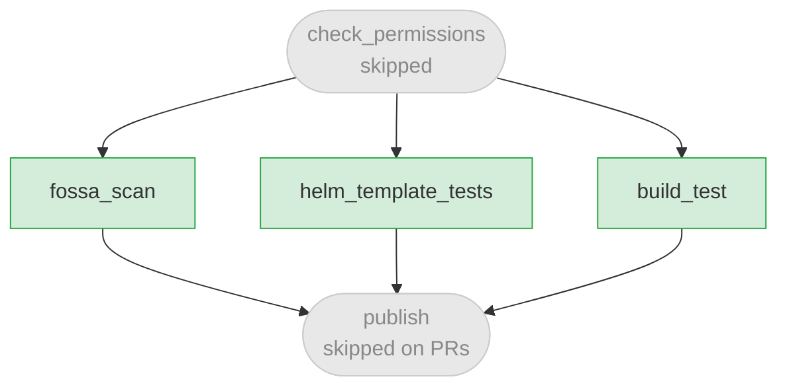
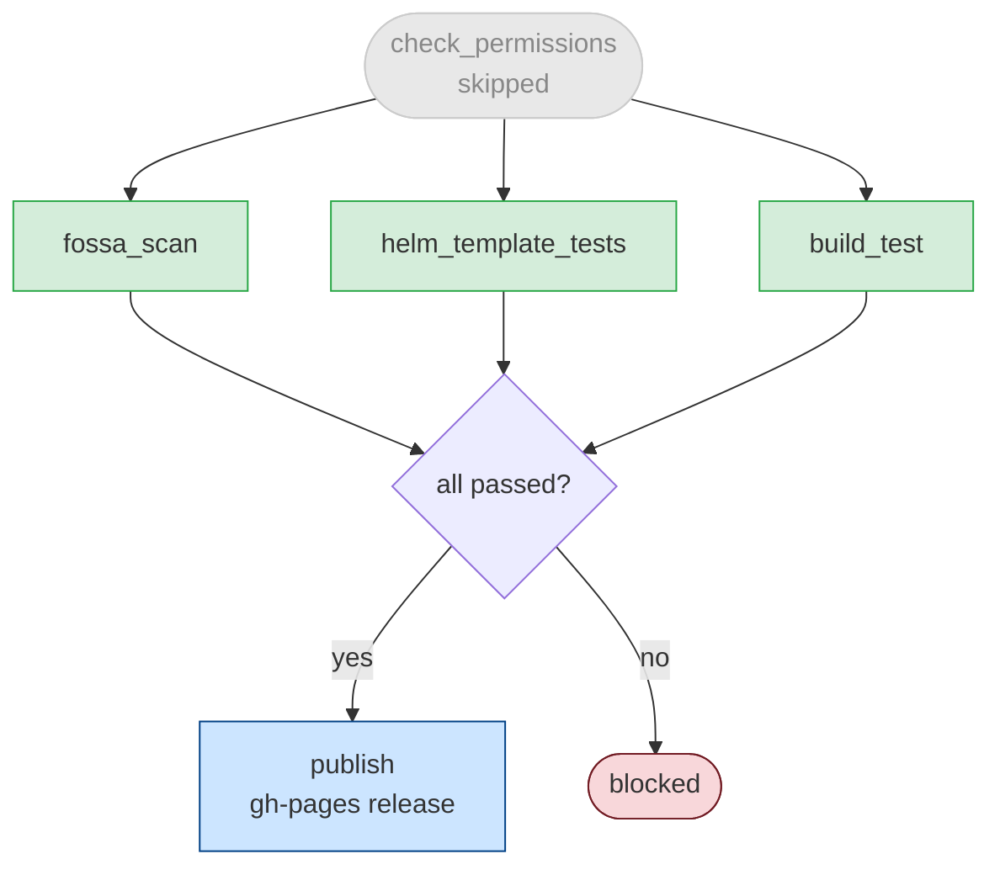

# Release Process

This document describes the CI/CD pipeline for `pubsubplus-kubernetes-helm-quickstart` — what runs on pull requests, what runs on merge to `master`, and how artifacts are published.

## Workflows

| File | Purpose | Trigger |
|---|---|---|
| `.github/workflows/ci.yaml` | Main CI/CD pipeline | PR, push to `master`, `workflow_dispatch` |
| `.github/workflows/test-helm-templates.yml` | Helm template unit tests | Called by `ci.yaml`, `workflow_dispatch` |
| `.github/workflows/fossa-scan.yaml` | On-demand FOSSA license scan | `workflow_dispatch` only |

---

## On Pull Request

Triggered when a PR is opened, synchronized, or reopened against any branch.

### Jobs

#### `fossa_scan`
Calls the shared `sca-scan-and-guard.yaml` reusable workflow from `SolaceDev/solace-public-workflows`. Scans all dependencies for license compliance per the policy defined in `.fossa.yml` and `.github/workflow-config.json`. Results are posted as PR status checks.

#### `helm_template_tests`
Calls `.github/workflows/test-helm-templates.yml`. Installs Python dependencies from `tests/python/requirements.txt` and runs `pytest` against the Helm chart templates. Fast, no cluster required.

#### `build_test`
Spins up a GKE cluster and runs end-to-end integration tests:
- HA broker deploy and validation (TLS, config-sync, sdkperf traffic)
- HA broker upgrade
- Pod toleration scheduling
- Vertical scaling via `systemScaling` parameters (verified via SEMP API)
- Admin password configuration via Kubernetes secret
- Admin secret upgrade and migration scenarios
- Chart variant linting and dry-run (`pubsubplus`, `pubsubplus-ha`, `pubsubplus-dev`, OpenShift variants)

The cluster is deleted in a cleanup step that always runs, even on failure.

#### `publish`
**Does not run on PRs.** Only runs on push to `master` (see below).

---

## On Merge to `master` (Release)

Triggered on push to `master`. Runs the same job graph as a PR, with `publish` now active.

### Gate conditions for `publish`

All of the following must be true before `publish` runs:

- Event is a push to `refs/heads/master`
- `github.repository_owner == 'SolaceProducts'`
- `fossa_scan` result is `success` or `skipped`
- `build_test` result is `success`
- `helm_template_tests` result is `success`

### `publish` job

Packages and publishes Helm chart variants to the `gh-pages` branch:

1. Creates chart variants via `docs/helm-charts/create-chart-variants.sh`
2. Clones the `gh-pages` branch
3. Moves OpenShift chart tarballs into `gh-pages/helm-charts-openshift/` and re-indexes
4. Moves standard chart tarballs into `gh-pages/helm-charts/` and re-indexes
5. Commits and force-pushes to `gh-pages`, making charts available at:
   - `https://solaceproducts.github.io/pubsubplus-kubernetes-helm-quickstart/helm-charts`
   - `https://solaceproducts.github.io/pubsubplus-kubernetes-helm-quickstart/helm-charts-openshift`

---

## Skipping FOSSA (break-glass)

In the event FOSSA is unavailable, a repository admin can bypass the scan:

1. Go to **Actions → CI → Run workflow**
2. Set `skip_fossa` to `true`
3. Only users with `admin` permission on the repository can do this — the `check_permissions` job enforces this and will fail the run for non-admins

Alternatively, use the **FOSSA Manual Scan** workflow (`fossa-scan.yaml`) to run a standalone scan on any branch at any time without triggering the full CI pipeline.

---

## Adding a New Release

There is no separate release workflow. A release is the result of merging to `master`:

1. Open a PR with your changes
2. Ensure all PR checks pass (`fossa_scan`, `helm_template_tests`, `build_test`)
3. Merge the PR
4. The push to `master` triggers `ci.yaml`, which runs all checks again and, on success, publishes updated chart artifacts to `gh-pages`
5. Tag the release in GitHub manually if a versioned release marker is needed
